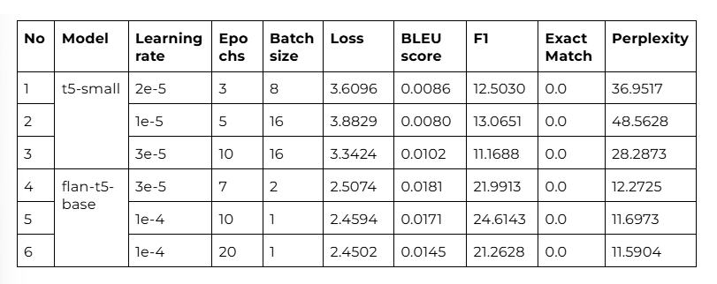

# Breast Cancer QA Chatbot (FLAN-T5)

This project fine-tunes Google's **FLAN-T5-Base** model on a domain-specific dataset to build a question-answering chatbot focused on **breast cancer**. The chatbot can respond to medical questions related to breast cancer with high accuracy based on the fine-tuned data.  It is aimed at providing informative and supportive responses to patients, survivors, and caregivers 

---

## 📁 Dataset

The dataset used— [grasool/breast-cancer-QAs-llama](https://huggingface.co/datasets/grasool/breast-cancer-QAs-llama) — was sourced from Hugging Face and contains 300+ high-quality medical QA pairs originally formatted in the [INST]...[/INST] chat structure used for LLaMA models.  

---

##  Preprocessing & Training

- All entries were cleaned using `BeautifulSoup` and regular expressions.
- Custom parsing extracted `QUESTION` and `ANSWER` fields.
- Tokenization used the **T5 tokenizer**, without additional prefixes (FLAN-T5 is already instruction-tuned).
- **Gradient accumulation** (8 steps) was applied to handle GPU memory constraints.
- Final Model trained using **AdamW optimizer** with a learning rate of `1e-4`.

Final configuration:
- **Model**: `google/flan-t5-base`
- **Epochs**: 20  
- **Batch Size**: 1  
- **Eval Strategy**: per epoch  
- **Early Stopping**: patience 5  

---

## 📊 Performance Metrics

Model performance was evaluated using a combination of metrics. Below is the experiment table



The final FLAN-T5 model demonstrated superior generalization and understanding of medical language, outperforming smaller or shorter-trained models across all evaluation metrics.

---

## 🚀 Running the Chatbot

### 1. Clone the repo

```bash
git clone https://github.com/tomunizua/breast_cancer-qa_chatbot.git
cd breast_cancer-qa_bot
```

### 2. Install dependencies

```bash
pip install -r requirements.txt
```

### 3. Access the Chatbot

The chatbot is publicly accessible via **Streamlit**:  
🌐 [Launch Chatbot](https://your-streamlit-link.streamlit.app)

You can also run it locally by executing:

```bash
streamlit run app.py
```

---

## 🎥 Demo Video

Watch a demo of the chatbot in action here:  
📹 [Demo Video](https://your-demo-video-link.com)

---

## 💬 Example Conversations


---

## 📌 Notes

- Model trained and evaluated using PyTorch & Hugging Face's `Trainer`.
- Uses `evaluate` library to compute BLEU, SQuAD, and ROUGE metrics.
- For low-resource training, the use of gradient accumulation and early stopping proved essential.